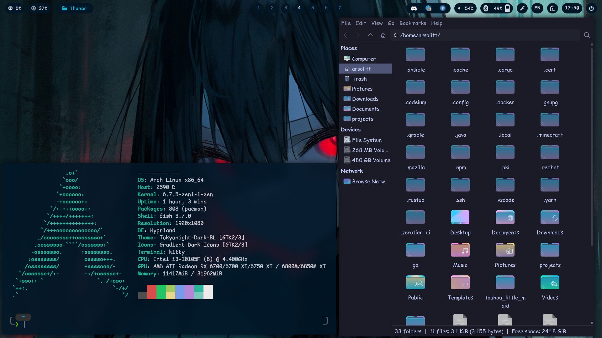

<h1 align="center">Мои dot-файлы для сетапа Arch + Hyprland</h1>

## Основной софт

- Hyprland
- Hyprpaper
- Waybar
- Wofi
- Dunst
- Nemo
- Kitty
- Fish
- Grim + Slurp + Swappy
- Cursor: Bibata Modern Classic
- GTK: Ant-slim
- Font: Maple Mono NF

## Скриншотики

## Licensing

Да что хотите делайте с ними
