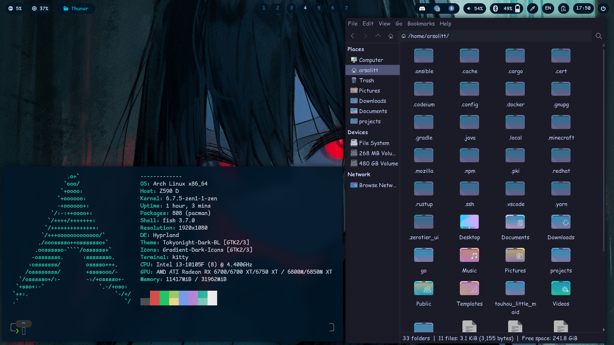
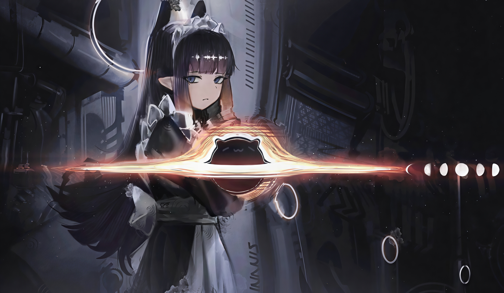

<h1 align="center">CachyOS + Hyprland</h1>

## Overview
- Hyprland
- Hyprpaper
- Hyprlock
- Waybar
- Rofi
- Nemo
- Kitty
- Kitty theme: Kanagawa
- Fish
  ```sh
  tide configure --auto --style=Classic --prompt_colors='16 colors' --show_time=No --classic_prompt_separators=Vertical --powerline_prompt_heads=Round --powerline_prompt_tails=Flat --powerline_prompt_style='Two lines, character' --prompt_connection=Disconnected --powerline_right_prompt_frame=No --prompt_spacing=Compact --icons='Few icons' --transient=Yes
  ```
- Fish theme: Kanagawa
- Screenshots: Grim + Slurp + Swappy
- Cursor: vimix Kanagawa Lotus
- GTK: Kanagawa Orange Dark
- Icons: Kanagawa
- Font: Agave Nerd

## Screenshots



## Wallpapers

#### Original

