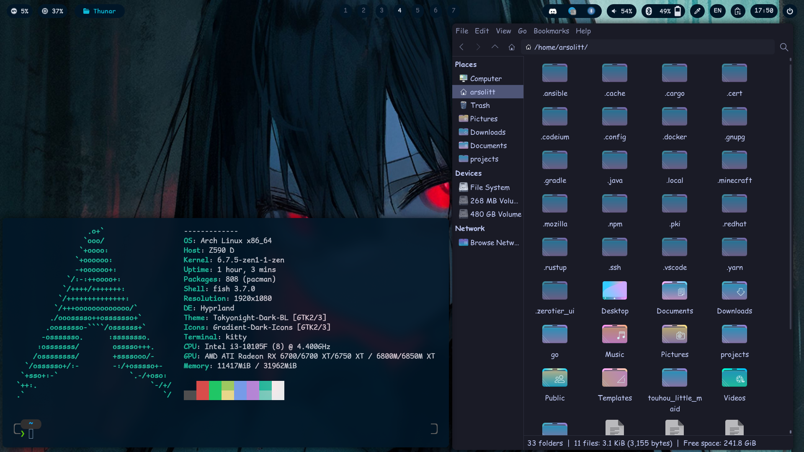
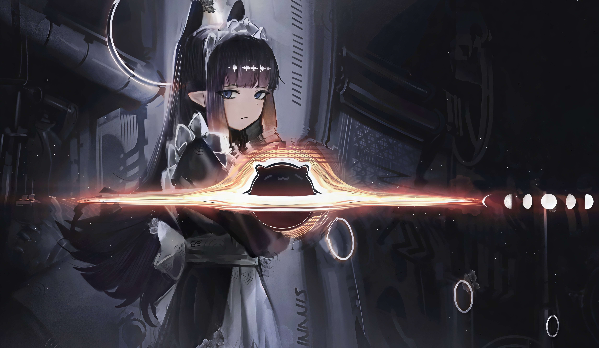

<h1 align="center">dots</h1>

## Linux (CachyOS + Hyprland)
- Hyprland
- Hyprpaper
- Hyprlock
- Waybar
- Rofi
- Nemo
- Kitty
- Kitty theme: Kanagawa
- Fish
- Starship prompt (Kanagawa two-line)
- Fish theme: Kanagawa
- Screenshots: Grim + Slurp + Swappy
- Cursor: vimix Kanagawa Lotus
- GTK: Kanagawa Orange Dark
- Icons: Kanagawa
- Font: FantasqueSansM

## macOS
- Ghostty (Kanagawa palette inlined)
- Font: JetBrainsMono Nerd Font
- tmux + TPM (resurrect/continuum, Kanagawa powerline status)
- Sketchy-bar (Kanagawa)
- Fish + Starship (Kanagawa two-line)
- Raycast

## Screenshots

## Wallpapers

#### Original

